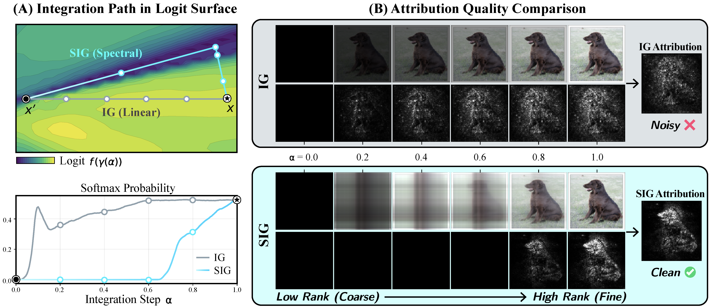

# Spectral Integrated Gradients for Coarse-to-Fine Feature Attribution

<p align="center">
    
</p>

This repository provides the source code for our paper **"Spectral Integrated Gradients for Coarse-to-Fine Feature Attribution,"** accepted to **ACM SIGKDD Conference on Knowledge Discovery and Data Mining (KDD) 2026**.

SIG (Spectral Integrated Gradients) is a feature attribution method that constructs the integration path in the frequency domain, traversing from coarse (low-frequency) to fine (high-frequency) image components. This coarse-to-fine path yields sharper and more faithful attributions than path-integral baselines that interpolate directly in pixel space.

## Installation

```bash
conda create -n sig python=3.9
conda activate sig
pip install -e .
pip install -r requirements.txt
```

The provided `requirements.txt` pins `torch==2.7.0` (CUDA 12.8 wheel) and `torchvision==0.22.0`. Adjust the `--extra-index-url` line in `requirements.txt` if you need a different CUDA build.

## Datasets

We evaluate on three image classification datasets (and CIFAR-10 for ROAR):

- **ImageNet (ILSVRC2012)** — standard validation split.
- **Oxford-IIIT Pet** — 37 fine-grained breeds.
- **Oxford Flowers 102** — 102 flower species.
- **CIFAR-10** — used for the ROAR benchmark.

Datasets are *not* shipped with this repository. Edit the `dataset_path` field in the corresponding YAML under `configs/dataset/` before running any script:

```yaml
# configs/dataset/oxfordpet.yaml
dataset_path: /path/to/oxfordpet/images
```

```yaml
# configs/dataset/oxfordflower.yaml
dataset_path: /path/to/oxfordflower
```

```yaml
# configs/dataset/imagenet.yaml
dataset_path: /path/to/imagenet2012
```

## Pretrained Classifiers

We provide the fine-tuned classifier checkpoints used in the paper for Oxford-IIIT Pet and Oxford Flowers 102 under `checkpoints/`:

```
checkpoints/
├── classifier_oxfordpet/
│   ├── vgg16_best.pt
│   ├── resnet18_best.pt
│   └── inception_best.pt
└── classifier_oxfordflower/
    ├── vgg16_best.pt
    ├── resnet18_best.pt
    └── inception_best.pt
```

For ImageNet we use `torchvision`'s pretrained weights directly, so no checkpoint is required. Checkpoint loading is handled in `scripts/diffid.py`, which resolves paths relative to the repository root.

## DiffID Benchmark

Each attribution method has a runner script under `scripts/benchmark_diffid/`:

```bash
# Our method (SIG)
bash scripts/benchmark_diffid/spectral_ig.sh <overlap>

# Baseline methods
bash scripts/benchmark_diffid/ig.sh
bash scripts/benchmark_diffid/big.sh
bash scripts/benchmark_diffid/ig2.sh
bash scripts/benchmark_diffid/gig.sh
bash scripts/benchmark_diffid/agi.sh
bash scripts/benchmark_diffid/eig.sh
bash scripts/benchmark_diffid/mig.sh
bash scripts/benchmark_diffid/samp.sh
bash scripts/benchmark_diffid/grad_input.sh
```

Each script iterates over:

- **Datasets**: ImageNet, Oxford-IIIT Pet, Oxford Flowers 102
- **Classifiers**: VGG-16, ResNet-18, Inception

Results are written to `results/benchmark_diffid/<dataset>/<method>/<model>/`.

## ROAR Benchmark

ROAR-style benchmarks (CIFAR-10) are provided under `scripts/benchmark_roar/`:

```bash
# Our method (SIG)
bash scripts/benchmark_roar/spectral_ig.sh

# Baseline methods
bash scripts/benchmark_roar/ig.sh
bash scripts/benchmark_roar/big.sh
bash scripts/benchmark_roar/ig2.sh
bash scripts/benchmark_roar/gig.sh
bash scripts/benchmark_roar/agi.sh
bash scripts/benchmark_roar/eig.sh
bash scripts/benchmark_roar/mig.sh
bash scripts/benchmark_roar/samp.sh
bash scripts/benchmark_roar/grad_input.sh
bash scripts/benchmark_roar/random.sh
```

Results are written to `results/benchmark_roar/<dataset>/<method>/`.

## Citation

If you use this codebase, please consider citing:

```bibtex
@inproceedings{kim2026spectral,
  title={Spectral Integrated Gradients for Coarse-to-Fine Feature Attribution},
  author={Kim, Soyeon and Lim, Seongwoo and Lee, Kyowoon and Choi, Jaesik},
  booktitle={Proceedings of the 32nd ACM SIGKDD Conference on Knowledge Discovery and Data Mining (KDD)},
  year={2026}
}
```

## License

This project is released under the [MIT License](LICENSE).
